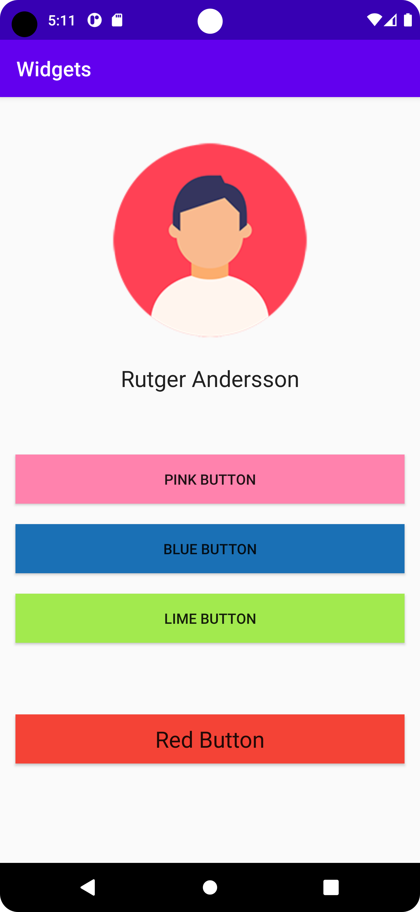

    
**Rapport**

Det första jag gjorde var navigera till filen activity_main.xml och lägga till en 
LinearLayout. Jag valde denna eftersom jag är nybörjare på layouts och den är lättare att förstå
än ConstraintLayout. 

```
<LinearLayout xmlns:android="http://schemas.android.com/apk/res/android"
xmlns:tools="http://schemas.android.com/tools"
android:layout_width="match_parent"
android:layout_height="match_parent"
android:orientation="vertical"
tools:context=".MainActivity">
```
Layoutens orientering är vertikal, vilket innebär att ordningen views läggs till är uppifrån och ner.

Min idé var att skapa någon typ av profilsida, så det första jag la till var en ImageView för profilbilden.
På höjden tar dem upp så mycket plats bilden behöver, medan den på bredden matchar layouten, vilket här
innebär att den tar upp hela skärmens bredd.
Jag använder layout_marginTop för att se till att det finns rum mellan toppen av bilden och toolbaren.

```
    <ImageView
        android:id="@+id/imageView"
        android:layout_width="match_parent"
        android:layout_height="wrap_content"
        android:layout_marginTop="40dp"
        android:contentDescription="@string/image_description" />
```
För att få in själva bilden, lägger jag in den i mappen drawable. Därefter går jag över till MainActivity.java ,
där jag skapar ett ImageView och ett Drawable objekt. Imageview objektet definierar jag med hjälp
av findViewById och hämtar då min ImageView ifrån actvity.main med hjälp av dess ID som helt enekelt är "imageView". 
Inuti drawable objektet förvaras profilbilden, vilket hämtas som koden här under visar.
Till sist lägger jag till drawable på Imageview, vilket resulterar i att bilden visas.

```
//Profilbild
imageView = findViewById(R.id.imageView);
drawable = getResources().getDrawable(R.drawable.profilepic);
imageView.setImageDrawable(drawable);
```

Under profilbilden finns en TextView som innehåller ett namn. Även här används layout_width och layout_height
samt layout_marginTop på liknande sätt som med bilden. Även kommandot android:gravity="center" används för att positionera
texten i mitten av skärmen. 

```
    <TextView
        android:id="@+id/textView"
        android:layout_width="match_parent"
        android:layout_height="wrap_content"
        android:layout_marginTop="20dp"
        android:gravity="center"
        android:text="@string/profile_name"
        android:textAppearance="@style/TextAppearance.AppCompat.Large" />
```

Under texten finns ett antal knappar i olika färger. Även med dessa är det ingen märkvärdig skillnad
i användadet av layout_width, layout_height och layout_marginTop. Här används dock även layout_marginHorizontal, 
för att ge rum mellan knapparna och skärmens kant, på både vänster och höger sida. android:bakground tillsammans
med en färgkod i hexadecimal.
```
    <Button
        android:id="@+id/button"
        android:layout_width="match_parent"
        android:layout_height="wrap_content"
        android:layout_marginTop="60dp"
        android:layout_marginHorizontal="15dp"
        android:background="#FF82AD"
        android:layout_gravity="center"
        android:text="@string/pink_button" />
```

På den sista, röda knappen, la jag även till kod som gör texten större.
```
android:textAppearance="@style/TextAppearance.AppCompat.Large" />
```

Alla strings är extraherade till filen strings.xml baserat på förslag från Android Studio.

**Screenshot**




